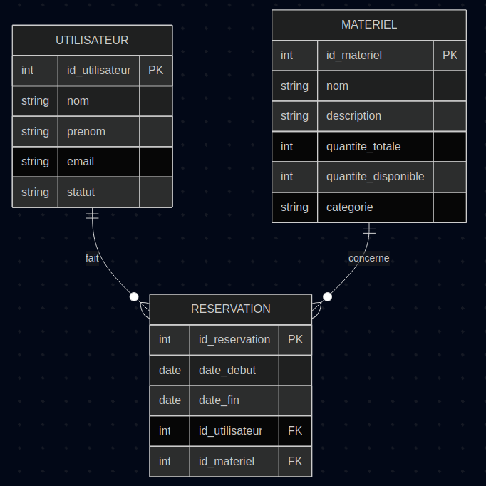

# Analyse du système de réservation de matériel

## 1. Analyse des besoins

### Entités identifiées

- **Utilisateur**
  - id_utilisateur (clé primaire)
  - nom
  - prénom
  - email
  - statut (étudiant, enseignant, personnel...)

- **Matériel**
  - id_materiel (clé primaire)
  - nom
  - description
  - quantité_totale
  - quantité_disponible
  - catégorie

- **Réservation**
  - id_reservation (clé primaire)
  - id_utilisateur (clé étrangère vers Utilisateur)
  - id_materiel (clé étrangère vers Matériel)
  - date_debut
  - date_fin

### Relations

- Un **Utilisateur** peut faire plusieurs **Réservations**.
- Une **Réservation** concerne un seul **Matériel**.
- Un **Matériel** peut être réservé plusieurs fois par différents utilisateurs.

---

## 2. Modélisation des données (Modèle conceptuel - MCD)

### Entités et attributs

- **Utilisateur**
  - id_utilisateur (PK)
  - nom
  - prénom
  - email
  - statut

- **Matériel**
  - id_materiel (PK)
  - nom
  - description
  - quantité_totale
  - quantité_disponible
  - catégorie

- **Réservation**
  - id_reservation (PK)
  - date_debut
  - date_fin
  - id_utilisateur (FK)
  - id_materiel (FK)

### Associations

- **Faire une réservation** : entre Utilisateur et Matériel via Réservation
  - Cardinalité : 
    - Un utilisateur peut faire plusieurs réservations
    - Un matériel peut être réservé plusieurs fois
    - Une réservation concerne un seul utilisateur et un seul matériel



---

## 3. Modélisation logique (Modèle relationnel)

### Tables et relations

```sql
Utilisateur(
    id_utilisateur SERIAL PRIMARY KEY,
    nom VARCHAR(50),
    prenom VARCHAR(50),
    email VARCHAR(100),
    statut VARCHAR(20)
)

Materiel(
    id_materiel SERIAL PRIMARY KEY,
    nom VARCHAR(100),
    description TEXT,
    quantite_totale INTEGER,
    quantite_disponible INTEGER,
    categorie VARCHAR(50)
)

Reservation(
    id_reservation SERIAL PRIMARY KEY,
    id_utilisateur INTEGER REFERENCES Utilisateur(id_utilisateur),
    id_materiel INTEGER REFERENCES Materiel(id_materiel),
    date_debut DATE,
    date_fin DATE
)

```
### Clés primaires et étrangères

Clés primaires : id_utilisateur, id_materiel, id_reservation

Clés étrangères :

    Reservation.id_utilisateur → Utilisateur.id_utilisateur

    Reservation.id_materiel → Materiel.id_materiel